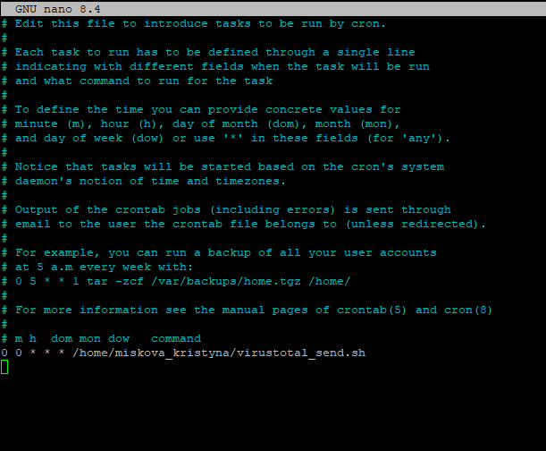
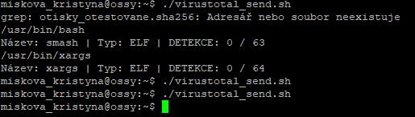

# Ověření otisku programu pomocí databáze VirusTotal

### Škola

Obchodní akademie, Vyšší odborná škola a Jazyková škola s právem státní jazykové zkoušky Uherské Hradiště

### Řešitelé

Kristýna Míšková a Alexa Helmichová

### Datum zpracování

21.04.2026 – 08.06.2026

## 1. Úvod

### 1.1. Cíl projektu

Cílem tohoto projektu bylo vytvořit skript, který zjistí všechny nynější běžící procesy v systému, vypočte jejich otisk a následně tento otisk porovná s databází VirusTotal. Výsledkem projektu bude skript, který uživateli vypíše výsledky o tom, kolikrát byl otisk souboru označen za škodlivý kód bez nutnosti nahrávat celý soubor na internet.

### 1.2. Využití v praxi

Tento projekt umožňuje uživateli zjistit nynější běžící procesy, z nich následně vypočítat otisk SHA256 a ten odeslat na prověření do VirusTotal. Skript ukládá i již otestované otisky, aby se do databáze znova neodesílaly. Následně si uživatel může nakonfigurovat Crontab, aby se skript spouštěl pravidelně.  
  
Skript je rozdělený na dvě části, kdyby uživatel chtěl s otisky podnikat i něco jiného.

### 1.3. Použité materiály

OS: Debian (VM)
Nástroje: VirusTotal, lsof, curl, jq, Crontab

### 1.4. Ověřitelné cíle

- Vypočtení otisku souboru  
- Získání zprávy s vyhodnocením od VirusTotal  
- Pravidelné spouštění úlohy přes Crontab

## 2. Postup řešení

### 2.1. Instalace nástrojů

    sudo apt update && sudo apt upgrade -y
    sudo apt install -y lsof
    sudo apt install -y curl
    sudo apt install -y jq

### 2.2. API klíč z VirusTotal

**Pro odeslání otisku na VirusTotal je třeba API klíče, který lze získat přihlášením se na jejich stránkách: https://www.virustotal.com/gui/sign-in** následně kliknout vpravo nahoře na vaše uživatelské jméno a vybrat "API Key". Zobrazí se vám stránka, kde v horní sekci lze vidět rozostřený klíč, který si do skriptu později vložíme.

### 2.3. Nachystání skriptů

Potřebné skripty lze najít v souborech "hash_calc.sh" a "virustotal_send.sh". Ty si stáhněte, či nakopírujte jejich obsah, a vložte do stejného adresáře.
Ve skriptu "virustotal_send.sh" přepište obsah proměnné **API_KEY** na váš klíč z VirusTotal.  
Je třeba nastavit i práva skriptů:

    chmod a+x hash_calc.sh virustotal_send.sh

### 2.4. Cron

    crontab -e
Zvolte číslo podle editoru, kterém chcete text upravovat a vložte:

    1. 2. 3. 4. 5. _cesta_k_"virustotal_send.sh"_
    
  1. Minuta (0 – 59)  
  2. Hodina (0 – 23)  
  3. Den v měsíci (1 – 31)  
  4. Měsíc (1 – 12)  
  5. Den v týdnu (0 = neděle, 1 = pondělí, 2 = úterý..., 6 = sobota)  
  
Příklady příkazů:  
Spouštění každý den o půlnoci

    0 0 * * * /cesta/virustotal_send.sh 

Spouštění každou neděli v 15:30

    30 15 * * 0 /usr/local/bin/virustotal_send.sh

Spouštění vždy prvního dne v měsíci

    * * 1 * * /home/r2/skripty/virustotal_send.sh

## 3. Dokumentace testování

Podle postupu řešení byly nachystány scripty.
Instalace Cronu proběhla úspěšně, proces se taky spouštěl podle zadání.

Pouze první spuštění proběhlo se zasíláním dat do databáze, jelikož na žádné další již nebyly nové procesy.

## 4. Rozdělení práce

<table>
    <tr>
        <td>Jméno člena</td>
        <td>Úkol</td>
    </tr>
    <tr>
        <td>Kristýna Míšková</td>
        <td>Testování, dokumentace</td>
    </tr>
    <tr>
        <td>Alexa Helmichová</td>
        <td>Řešení úlohy, dokumentace</td>
    </tr>
</table>

## 5. Závěr

### 5.1. Co se povedlo

Pomocí PID běžících procesů se vypočítá SHA256 otisk z jejich souboru.  
Úloha se spouští i za pomocí Crontab.

### 5.2. Co se nepovedlo

Úloha měla být původně řešená pomocí nástroje nmap, přes který se nepodařilo úspěšně odeslat požadavek do VirusTotal. Dotaz se v nynější verzi do VirusTotal odesílá pomocí příkazu curl.

### 5.3. Doporučení

V bezplatné verzi VirusTotal je omezená kapacita používání API klíčů, proto doporučujeme bezplatným uživatelům odkomentovat řádek 24, aby obsahoval příkaz:

    sleep 25

### 5.4. Rozšíření

VirusTotal nabízí i mnoho dalších návratových hodnot, které se dají prozkoumat.

## 6. Zdroje

Isalamon, hahakubile. _How do I get the path of a process in Unix / Linux?_ Stack Overflow. Stack Exchange Inc. Online. 03.03.2009. Dostupné z: https://stackoverflow.com/questions/606041/how-do-i-get-the-path-of-a-process-in-unix-linux. [citováno 2026-05-19]

VIRUSTOTAL. _Get a file report._ Online. VirusTotal. 2025. Dostupné z: https://docs.virustotal.com/reference/file-info. [citováno 2026-06-01]

Mitesh Agrawal, Sebastien D. _How can I get the reputation of filehashes on Virustotal using request and bs4 module and not using Virustotal's PublicAPI?_ Stack Overflow. Stack Exchange Inc. Online. 12.06.2019. Dostupné z: https://stackoverflow.com/questions/56561140/how-can-i-get-the-reputation-of-filehashes-on-virustotal-using-request-and-bs4-m. [citováno 2026-06-05]

Wikipedia. _Cron – Wikipedia._ Online. Wikimedia Foundation, 2001. 10:11 04.11.2025. Dostupné z: https://cs.wikipedia.org/wiki/Cron. [citováno 2026-06-08]
